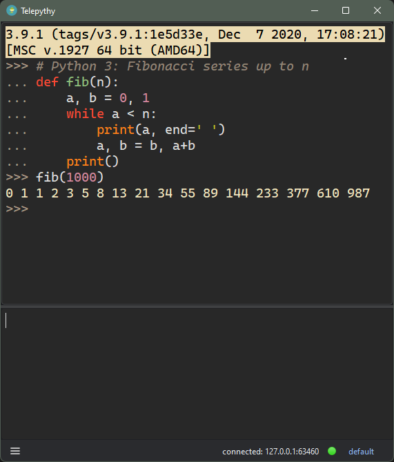
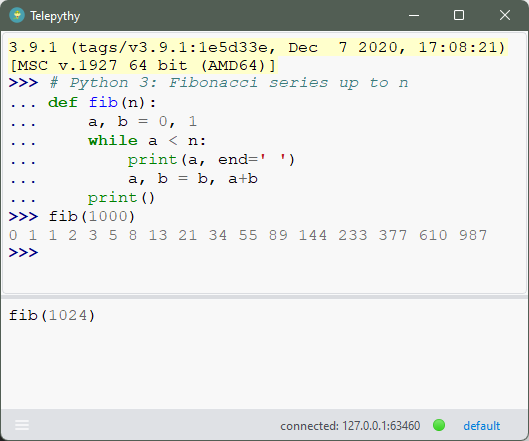
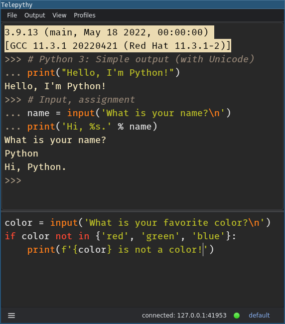

# Telepythy

Telepythy is a desktop Python shell inspired by [DreamPie][1] with some notable additional features, such as remote interpreters. It is designed to streamline a prototyping workflow.

## Features

* Combines the flow of a REPL with the expressiveness of an editor
* UI based on [Qt 6][8]
* Syntax highlighting based on [Pygments][7]
* Embeddable service with no third-party dependencies
* Remote connections (as client or server via TCP)
* Seamless swapping between multiple interpreter profiles

## Requirements

* UI requires Python 3 on Linux/Windows/OSX (tested: 3.6/3.7/3.9 on Linux/Windows)
* Embeddable service supports Python 2 and 3 on all platforms (tested: 2.7/3.6/3.7/3.9 on Linux/Windows)

## Screenshots

**Windows**




**Windows**
(*You can make it look like default IDLE if you want*)




**Linux/i3**




## Motivation

There are many Python shells:

* The standard Python shell
* [IDLE][12]
* [IPython/Jupyter][3]
* [ptpython][11]
* [bpython][10]
* [DreamPie][1]

They are all good in their own ways. I frequently use the standard Python shell, because it is always there. But when I have been able to install my preference for my most common use cases (prototyping and debugging), my choice was always DreamPie.

Unfortunately, it looks as if all development [stopped][2] sometime before 2016, and the last official release was in 2012. I looked into creating a fork to add the features I was interested in, but the effort to modernize (i.e. Python 3) and refactor an unfamiliar and complex code-base was more than I cared to invest in. Starting a new project seemed much more fun.

So, I decided to start from scratch, and **Telepythy** is the result.

## Installation

The most reliable way to install `telepythy` across platforms is with [pipx][9]:

```shell
$ pipx install telepythy
```

This will install **Telepythy** in an isolated environment for the current user, and should work on Windows, Linux, and OSX (untested).

# For Windows users, you can download an installer [here]

## Usage

Once **Telepythy** and its dependencies have been installed, you can start the UI with:

```shell
$ telepythy-gui
# or
$ python -m telepythy.gui
```

**NOTE**: At this early state, it may be helpful to use the `--verbose` (`-v` or `-vv`) flag to track what **Telepythy** is doing (especially if reporting a bug).

### Configuration

Style and font options can be configured with the UI. Manually editing the config file is currently the only way to persist any other options.

The config file is located according to the results of `appdirs.user_config_dir()` (e.g. `~/.config/telepythy/telepythy.cfg` on Linux, `C:\Users\<username>\AppData\Local\telepythy\telepythy.cfg` on Windows).

### Virtual Environments

Any virtual environments discovered in `~/.virtualenvs` will be accessible automatically in the *Profiles* menu.

### Embedding

To embed a **Telepythy** service in your code, you can use any of the following functions:

```python
import telepythy

# start a server thread
telepythy.start_server()

# or start a client thread
telepythy.start_client()

# or start a client/server directly (blocking), with optional arguments
telepythy.client(locals={'foo': True}, address='localhost:7373')
telepythy.server(locals={'bar': False}, address='localhost:1337')
```

See the `<telepythy>/examples` directory from the repository for examples on how to embed the service into existing code.

### Local Interpreters

To add a custom local interpreter, you must create a profile referencing the path for the interpreter in the config file:

```ini
[profiles]
<profile-name>.command = "<command-for-interpreter>"
```

### Remote Interpreters

The remote service needs to be accessible by whichever interpreter you intend to use. A minimal, service-only package can be installed from PyPI:

```shell
$ pip install telepythy-service
```

It can then be started using one of the following commands:

```shell
$ telepythy-svc [-c,--connect] '<host>:<port>'
$ telepythy-svc [-s,--serve] '<interface>:<port>'
# or
$ python -m telepythy ...
```

With no options, a server will start listening on the default interface and port: `localhost:7373`.

To use **Telepythy** with a remote service, you must create a profile to either connect to a remote port, or serve on a port, in the config file.

To add a connect profile:

```ini
[profiles]
<profile-name>.connect = "<host>:<port>"
```

To add a serve profile:

```ini
[profiles]
<profile-name>.serve = "<interface>:<port>"
```

You can then use the profile by selecting it in the UI, or with the `--profile` command-line option:

```shell
$ telepythy-gui [-p,--profile] <profile-name>
```

## API

*work in progress*

## Security

There are no security measures in place within **Telepythy** to secure your source code in transit. The UI controller connects to the embedded service using a regular TCP connection. By default, the UI starts a server listening on *localhost* and executes a Python process that connects to it. In the future, the default may change to use UNIX domain sockets on Linux, and named pipes on Windows. An option for SSL is possible for those willing to manage certificates. However, securing communications in transit will always remain a responsibility of the user.

For connections across machines, I recommend using [SSH port forwarding][6].

## Roadmap

**Telepythy** is very much a work in progress. Here are some features that might be queued up for future releases (in no particular order):

* Better completion (next on the docket)
* Profile configuration UI
* Smart copy/paste
* UNIX domain sockets
* SSL sockets
* Session autosave/import/export
* Embedded documentation
* Localization (at least Spanish)

If you experience bugs or have additional feature suggestions, please don't hesistate to create an [issue][5]. Note that I work on this project in my free time and I don't expect to work on features that I don't personally find useful. I do prioritize bugs, and welcome pull requests.

[1]: http://www.dreampie.org/
[2]: https://github.com/noamraph/dreampie/issues/65
[3]: https://jupyter.org/
[4]: https://wiki.qt.io/Qt_for_Python
[5]: https://github.com/dhagrow/telepythy/issues/new
[6]: https://help.ubuntu.com/community/SSH/OpenSSH/PortForwarding
[7]: https://pygments.org
[8]: https://www.qt.io
[9]: https://pypa.github.io/pipx/
[10]: https://bpython-interpreter.org
[11]: https://github.com/prompt-toolkit/ptpython
[12]: https://docs.python.org/3/library/idle.html
