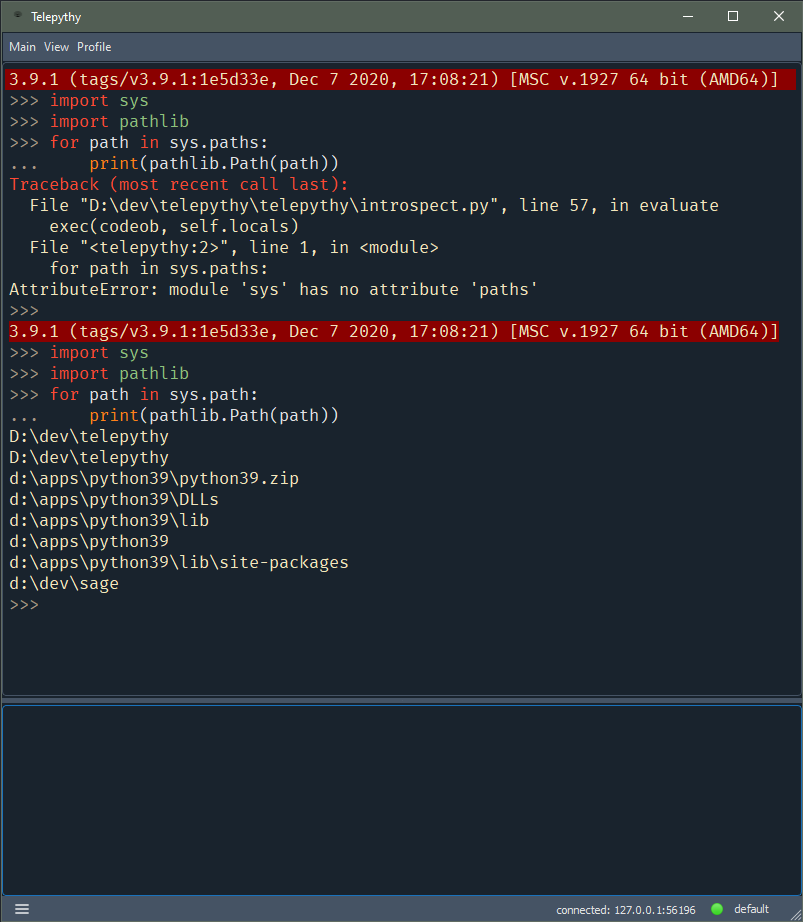

# Telepythy

Telepythy is a desktop Python shell inspired by [DreamPie][1] with some notable additional features. It is designed to streamline a prototyping workflow.

## Features

* Divided editor for code
* UI based on Qt 5
* Syntax highlighting (based on Pygments)
* Embeddable service with no third-party dependencies
* Connections to remote Python interpreters (as client or server)
* Swap between multiple interpreter profiles (local or remote)
* UI requires Python 3 on Linux/Windows/OSX (tested: 3.6/3.9 on Linux/Windows)
* Embeddable service supports Python 2 and 3 on all platforms (tested: 2.7/3.6/3.9 on Linux/Windows)

## Screenshots

**Linux/I3**<br>
<br>
**Windows**
<br>


## Motivation

As a long-time user of [DreamPie][1], I have grown comfortable with the workflow that it offers. However, I have often wished for additional features. Unfortunately, it looks as if all development [stopped][2] sometime before 2016, and the last official release was in 2012. I looked into creating a fork to add the features I was interested in, but the effort to modernize (i.e. Python 3) an unfamiliar and complex code-base was too daunting for me.

Of course, [Jupyter][3] exists and is very powerful. But I have always found the workflow awkward. I don't really want a shareable code notebook. I want a prototyping and debugging tool.

So, I decided to start from scratch, and **Telepythy** is the result.

## Installation

At the moment there is no installer available for **Telepythy**. The easiest option is to use `pip`:

```shell
$ pip install telepythy
```

**NOTE**: This will pull in [PySide2][4], which weighs in at >100mb. I expect the eventual installer to be <20mb.

## Usage

Once **Telepythy** and its dependencies have been installed, you can start the UI with:

```shell
$ python -m telepythy.gui
```

**NOTE**: There are simplified entry points in the `<telepythy>/scripts` directory.

**NOTE**: At this early state, it may be helpful to use the `--verbose` (`-v` or `-vv`) flag to track what **Telepythy** is doing (especially if reporting a bug).

### Remote Service

To use **Telepythy** with a remote service, you must create a profile to either connect to a remote port, or serve on a port. Currently that must be done by editing the config file (located according the the results of `appdirs.user_config_dir()`, e.g. `~/.config/telepythy.cfg` on Linux).

To add a connect profile:

```ini
[profile.<profile_name>]
connect = '<host>:<port>'
```

To add a serve profile:

```ini
[profile.<profile_name>]
serve = '<interface>:<port>'
```

You can then use the profile by selecting it in the UI, or with the `--profile` command-line option:

```shell
$ python -m telepythy.gui [-p,--profile] <profile_name>
```

The remote service can be started using one of the following commands (opposing the profile option used by the UI):

```shell
$ python -m telepythy --connect '<host>:<port>'
$ python -m telepythy --serve '<interface>:<port>'
```

### Embedding

See the `<telepythy>/examples` directory for examples on how to embed the service into existing code.

## Documentation

*work in progress*

## Security

To be explicit, there are no security measures in place within **Telepythy** to secure your source code in transit. The UI controller connects to the embedded service using a regular TCP connection. By default, the UI starts a server listening on *localhost* and executes a Python process that connects to it. In the future, I may change the default to use UNIX domain sockets on Linux, and named pipes on Windows. However, securing the source code in transit will remain the responsibility of the user.

For connections across machines, I recommend using [SSH port forwarding][6].

## Roadmap

**Telepythy** is very much a work in progress. Here are some features that are planned for future releases (in no particular order):

* Minimal PyPI package for the embeddable service (no dependencies)
* Configuration UI
* Profile configuration UI
* Style/syntax highlighting configuration UI
* Smart copy/paste
* UNIX domain sockets
* Folding for code and output blocks
* Code snippets
* Session import/export
* Embedded documentation
* Platform installers
* Upgrade to PySide6 (QML? snake_case!)
* Localization
* Website/logo

If you have additional feature suggestions, please don't hesistate to create an [issue][5]. Note that I work on this project in my free time and I don't expect to work on features that I don't personally find useful. I do, however, welcome pull requests.

[1]: http://www.dreampie.org/
[2]: https://github.com/noamraph/dreampie/issues/65
[3]: https://jupyter.org/
[4]: https://wiki.qt.io/Qt_for_Python
[5]: https://github.com/dhagrow/telepythy/issues/new
[6]: https://help.ubuntu.com/community/SSH/OpenSSH/PortForwarding
